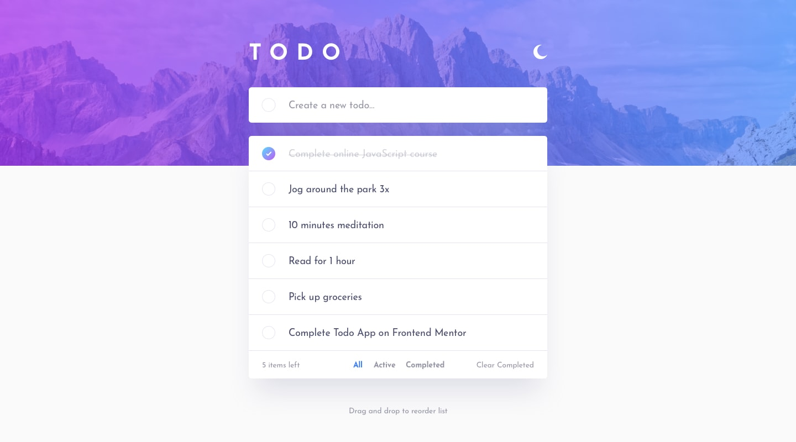
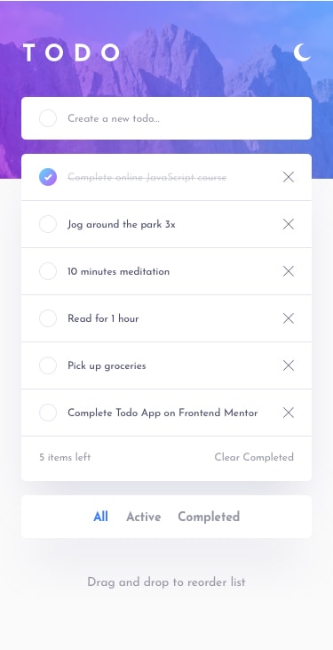
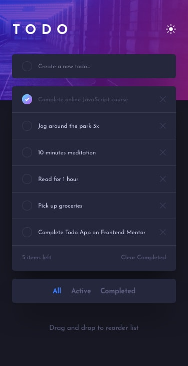

# 📝 Todo App

A modern and responsive Todo App built with HTML, SCSS, and JavaScript.

## 🚀 Live Demo

* 🌐 Live Site: [Add Live URL Here](https://aliyasserdev-pixel.github.io/todo-app-javascript-2-/)
* 💻 GitHub Repository: [Add Repository URL Here](https://github.com/aliyasserdev-pixel/todo-app-javascript-2-.git)
* 🎯 Frontend Mentor Solution: [Add Frontend Mentor URL Here](#)
* 🔗 LinkedIn: [Add LinkedIn URL Here](https://www.linkedin.com/in/ali-yasser-b0b38138a/)

---

## 📸 Preview

### Desktop Light Mode



### Desktop Dark Mode


### Mobile Light Mode



### Mobile Dark Mode



---

## ✨ Features

* Add new todos
* Mark todos as completed
* Delete todos
* Filter todos:

  * All
  * Active
  * Completed
* Clear completed tasks
* Dark mode toggle
* Responsive design
* Clean and modern UI

---

## 🛠️ Built With

* HTML5
* SCSS (Sass)
* JavaScript (Vanilla JS)
* Flexbox
* Mobile First Workflow

---

## ⚙️ Run Sass

```bash
sass --watch scss/style.scss:css/style.css
```

---

## 📚 What I Learned

During this project I practiced:

* DOM Manipulation
* Event Handling
* Dynamic UI Updates
* SCSS File Architecture
* Responsive Layout Design
* Dark Mode Implementation

---

## 👨‍💻 Author

Ali Yasser

Frontend Developer
